# Module Federation Runtime Hooks Analysis

## Understanding How Fallbacks Work in loadRemote Failures

This analysis explains how our solution prevents the crash described in the README when the `foo: "bar@http://example.org/remote-manifest.json"` remote cannot be fetched.

Based on detailed analysis of the Module Federation runtime core source code at `/Users/bytedance/dev/core/packages/runtime-core`, here's how runtime hooks and fallbacks work:

## Hook System Architecture

The Module Federation runtime uses a sophisticated plugin system built on four main hook types:


### Hook Types
1. **SyncHook** - Synchronous execution
2. **AsyncHook** - Asynchronous execution with abort capability  
3. **SyncWaterfallHook** - Synchronous data transformation pipeline
4. **AsyncWaterfallHook** - Asynchronous data transformation pipeline

## Module Federation Core Hook Structure

Based on analysis of the actual source code at `/Users/bytedance/dev/core/packages/runtime-core/src/`, here's the accurate hook system organization:

```mermaid
classDiagram
    class ModuleFederation {
        +hooks: PluginSystem
        +loaderHook: PluginSystem
        +bridgeHook: PluginSystem
        +snapshotHandler: SnapshotHandler
        +remoteHandler: RemoteHandler
        +sharedHandler: SharedHandler
    }
    
    class PluginSystem {
        +lifecycle: HooksMap
        +emit(): any
        +tap(): void
    }
    
    class RemoteHandler {
        +hooks: PluginSystem
        +beforeRequest: AsyncWaterfallHook
        +onLoad: AsyncHook
        +errorLoadRemote: AsyncHook ⭐
        +loadEntry: AsyncHook
        +handlePreloadModule: SyncHook
        +beforePreloadRemote: AsyncHook
        +generatePreloadAssets: AsyncHook
    }
    
    class SnapshotHandler {
        +hooks: PluginSystem
        +beforeLoadRemoteSnapshot: AsyncHook
        +loadSnapshot: AsyncWaterfallHook
        +loadRemoteSnapshot: AsyncWaterfallHook
        +afterLoadSnapshot: AsyncWaterfallHook
        +manifestCache: Map
        +getManifestJson() ⭐⭐
    }
    
    class SharedHandler {
        +hooks: PluginSystem
        +afterResolve: AsyncWaterfallHook ⭐
        +beforeLoadShare: AsyncWaterfallHook
        +loadShare: AsyncHook
        +resolveShare: SyncWaterfallHook
        +initContainerShareScopeMap: SyncWaterfallHook
    }
    
    ModuleFederation --> PluginSystem
    ModuleFederation --> RemoteHandler
    ModuleFederation --> SnapshotHandler
    ModuleFederation --> SharedHandler
    RemoteHandler --> PluginSystem
    SnapshotHandler --> PluginSystem
    SharedHandler --> PluginSystem
    
    note for RemoteHandler "⭐ errorLoadRemote hook"
    note for SnapshotHandler "⭐⭐ getManifestJson calls errorLoadRemote<br/>THIS IS WHERE README CRASH OCCURS"
    note for SharedHandler "⭐ afterResolve for remote matching"
```



## Key Runtime Hooks for Remote Loading

### 1. `errorLoadRemote` Hook
**Most Critical for Fallback Handling**

```typescript
errorLoadRemote: new AsyncHook<
  [
    {
      id: string;
      error: unknown;
      options?: any;
      from: CallFrom;
      lifecycle: 'beforeRequest' | 'beforeLoadShare' | 'afterResolve' | 'onLoad';
      origin: ModuleFederation;
    },
  ],
  void | unknown
>('errorLoadRemote')
```

## Remote Loading Lifecycle Flow

Based on analysis of `/Users/bytedance/dev/core/packages/runtime-core/src/remote/index.ts`, here's the complete remote loading flow:

```mermaid
sequenceDiagram
    participant Host as Host Application
    participant RH as RemoteHandler
    participant SH as SnapshotHandler
    participant SharedH as SharedHandler
    participant Module as Remote Module
    participant Network as Network

    Host->>RH: loadRemote(id, options)
    
    Note over RH: 1. beforeRequest Hook
    RH->>RH: beforeRequest hook execution
    alt Hook Error
        RH->>RH: errorLoadRemote(lifecycle: 'beforeRequest')
        Note right of RH: Plugin can return modified args<br/>or alternative configuration
    end
    
    RH->>RH: matchRemoteWithNameAndExpose()
    RH->>SharedH: afterResolve hook
    
    Note over SharedH: 2. Manifest Resolution
    SharedH->>SH: Load remote snapshot info
    SH->>Network: Fetch manifest.json
    alt Network Failure ❌
        SH-->>SharedH: Manifest fetch failed
        SharedH->>RH: afterResolve error
        RH->>RH: errorLoadRemote(lifecycle: 'afterResolve')
        Note right of RH: ⭐ THIS IS WHERE README ISSUE OCCURS<br/>Plugin must return fallback manifest
    else Success ✅
        Network-->>SH: manifest.json
        SH-->>SharedH: Parsed manifest
    end
    
    SharedH-->>RH: Resolved module info
    RH->>Module: new Module(moduleOptions)
    
    Note over Module: 3. Module Loading
    RH->>Module: module.get(id, expose, options)
    Module->>Network: Load module entry
    alt Module Load Error ❌
        Module-->>RH: Module load failed
        RH->>RH: errorLoadRemote(lifecycle: 'onLoad')
        Note right of RH: Plugin can return fallback component
    else Success ✅
        Network-->>Module: Module loaded
        Module-->>RH: Module factory/component
    end
    
    Note over RH: 4. onLoad Hook
    RH->>RH: onLoad hook execution
    RH-->>Host: Final module/component
    
    Note over Host: Application continues normally
```



### 2. Lifecycle Stages Where Errors Occur

#### a) **beforeRequest** - Initial Request Processing
- **Location**: `/packages/runtime-core/src/remote/index.ts:328-351`
- **Purpose**: Preprocesses module requests before fetching
- **Fallback Strategy**: Return modified request args or alternative configuration

#### b) **afterResolve** - Manifest Resolution Stage ⭐ **CRITICAL** 
- **Location**: `/packages/runtime-core/src/plugins/snapshot/SnapshotHandler.ts:298-306`
- **Called from**: `SnapshotHandler.getManifestJson()` during manifest fetch failures
- **Purpose**: **This is where the README crash occurs** - when manifest.json fetch fails
- **Fallback Strategy**: Return alternative manifest data or backup entry points

#### c) **onLoad** - Module Loading Stage
- **Location**: `/packages/runtime-core/src/remote/index.ts:254-267` 
- **Purpose**: During actual module loading and execution
- **Fallback Strategy**: Return fallback component/module factory

#### d) **beforeLoadShare** - Shared Dependency Loading
- **Location**: `/packages/runtime-core/src/shared/index.ts:318-325`
- **Purpose**: When loading shared dependencies fails during remote initialization
- **Fallback Strategy**: Return alternative shared modules

## Error Handling Flow

The `errorLoadRemote` hook is the cornerstone of error handling in Module Federation. Here's how it works:

```mermaid
flowchart TD
    Start([Remote Loading Starts]) --> BeforeReq{beforeRequest Hook}
    BeforeReq -->|Success| MatchRemote[Match Remote & Expose]
    BeforeReq -->|Error| ErrBeforeReq[errorLoadRemote<br/>lifecycle: beforeRequest]
    
    ErrBeforeReq -->|Plugin returns modified args| MatchRemote
    ErrBeforeReq -->|Plugin returns falsy| Crash1[❌ Application Crash]
    
    MatchRemote --> ManifestFetch{SnapshotHandler<br/>getManifestJson}
    ManifestFetch -->|Success| CreateModule[Create Module Instance]
    ManifestFetch -->|Error ⭐ Manifest Fetch Fails| ErrAfterResolve[errorLoadRemote<br/>lifecycle: afterResolve]
    
    ErrAfterResolve -->|Plugin returns fallback manifest| CreateModule
    ErrAfterResolve -->|Plugin returns falsy ⭐ README CRASH POINT| Crash2[❌ Application Crash<br/>🔥 THIS IS THE README ISSUE]
    
    CreateModule --> ModuleLoad{module.get}
    ModuleLoad -->|Success| OnLoadHook[onLoad Hook]
    ModuleLoad -->|Error Module Load Fails| ErrOnLoad[errorLoadRemote<br/>lifecycle: onLoad]
    
    ErrOnLoad -->|Plugin returns fallback component| OnLoadHook
    ErrOnLoad -->|Plugin returns falsy| Crash3[❌ Module Load Error]
    
    OnLoadHook --> Success([✅ Module Loaded Successfully])
    
    style ErrAfterResolve fill:#ffcdd2
    style Crash2 fill:#f44336,color:#fff
    style Success fill:#c8e6c9
    style ErrBeforeReq fill:#fff3e0
    style ErrOnLoad fill:#fff3e0
    style ManifestFetch fill:#e1f5fe
```



### Critical Error Points

1. **beforeRequest Errors** - Rare, usually configuration issues during remote matching
2. **afterResolve Errors** - **🔥 MOST CRITICAL** - Called from `SnapshotHandler.getManifestJson()` when manifest fetch fails (README issue location)
3. **onLoad Errors** - Module execution failures, can be handled with UI fallbacks  
4. **beforeLoadShare Errors** - Shared dependency loading failures during remote init

### Key Finding: SnapshotHandler Calls errorLoadRemote

The critical discovery from the source code analysis:
- **SnapshotHandler.getManifestJson()** (lines 298-306) calls `errorLoadRemote` with `lifecycle: 'afterResolve'`
- This happens during manifest fetching when `fetch(manifestUrl)` fails
- **This crash occurs with BOTH share strategies**: `"loaded-first"` AND `"version-first"`

### Share Strategy Impact on Remote Loading

Both share strategies trigger eager remote loading, causing the same crash scenario:

#### `shareStrategy: "loaded-first"` (README case)
- Mentioned explicitly in the README as causing the crash
- Eagerly fetches remote manifests during initialization

#### `shareStrategy: "version-first"` (Same crash risk)
- **Source**: `/packages/runtime-core/src/shared/index.ts:342-351`
- Also calls `initRemoteModule(remote.name)` for each remote (line 348)
- **Same crash potential** when `foo: "bar@http://example.org/remote-manifest.json"` fails
- Note: The TODO comment (line 341) indicates this strategy may be deprecated

**Both strategies require our enhanced offline fallback plugin** to prevent application crashes from unreachable remotes.

## How Fallbacks Work

### Pattern 1: Component-Level Fallbacks (onLoad)
```typescript
async errorLoadRemote(args) {
  if (args.lifecycle === 'onLoad') {
    // Return a factory function that provides fallback component
    return () => ({
      __esModule: true,
      default: FallbackComponent,
    });
  }
}
```

### Pattern 2: Manifest-Level Fallbacks (afterResolve) 
```typescript
async errorLoadRemote(args) {
  if (args.lifecycle === 'afterResolve') {
    try {
      // Try alternative manifest source
      const backupManifest = await fetch(backupUrl);
      return backupManifest.json();
    } catch (error) {
      return args; // Continue with original (will likely fail)
    }
  }
}
```

### Pattern 3: Request-Level Fallbacks (beforeRequest)
```typescript
async errorLoadRemote(args) {
  if (args.lifecycle === 'beforeRequest') {
    // Return modified request parameters
    return {
      ...args,
      id: `backup-${args.id}`, // Try backup remote
    };
  }
}
```

## Critical Insights for Our Plugin

### 1. Return Value Semantics
- **Return falsy** (`false`, `null`, `undefined`) → No fallback, original error thrown
- **Return data/function** → Use as replacement/fallback
- **Return modified args** → Continue with modified parameters

### 2. Lifecycle-Specific Handling
Our plugin should handle each lifecycle differently:
- **beforeRequest**: Alternative remote configurations
- **afterResolve**: Backup manifest sources  
- **onLoad**: UI component fallbacks
- **beforeLoadShare**: Alternative shared dependencies

### 3. Circuit Breaker Integration
The runtime doesn't have built-in circuit breakers, so our plugin's circuit breaker pattern is valuable for:
- Preventing repeated failed requests
- Faster fallback responses
- Reduced network overhead

### 4. Hook Execution Context
Hooks are executed within specific handlers:
- **RemoteHandler** - Remote module lifecycle
- **SharedHandler** - Shared dependencies
- **SnapshotHandler** - Manifest loading
- **Module** - Individual module execution

## Enhanced Offline Fallback Plugin Integration

Our plugin integrates into the Module Federation runtime through strategic hook interception:


### Plugin Hook Registration

Based on runtime plugin architecture, our plugin registers as follows:


## How Our Plugin Solves the README Problem

### The Crash Scenario (Without Plugin)
1. Host app configures: `foo: "bar@http://example.org/remote-manifest.json"`
2. With `shareStrategy: "loaded-first"`, Module Federation eagerly fetches all remotes at startup
3. Fetch to `http://example.org/remote-manifest.json` fails (404/network error)
4. `errorLoadRemote` hook is called with `lifecycle: 'afterResolve'`
5. **Without our plugin**: No handler returns a fallback, error propagates, app crashes
6. Result: White screen, even though `foo` is never imported

### The Solution (With Our Plugin)
1. Same configuration and fetch attempt
2. Fetch fails, `errorLoadRemote` hook called
3. **Our plugin intercepts** at `afterResolve` lifecycle:
   ```typescript
   if (lifecycle === 'afterResolve') {
     // Return a fallback module instead of crashing
     return createFallbackModule(remoteId, error);
   }
   ```
4. Module Federation receives the fallback module and continues
5. App loads successfully, working remotes function normally
6. Result: App works, displays "Rspack + React + TypeScript" with working remotes

## Our Enhanced Plugin's Alignment

✅ **Well-Aligned Features:**
- Proper lifecycle handling (`beforeRequest`, `afterResolve`, `onLoad`)
- Prevents crashes at manifest fetch stage (`afterResolve`)
- Component-level fallbacks for `onLoad` failures
- Circuit breaker for performance optimization
- Retry logic with exponential backoff
- Caching of fallback modules

✅ **Specific Solution for README Issue:**
- Handles `afterResolve` errors when manifest fetch fails
- Returns valid fallback modules instead of letting errors propagate
- Allows app to continue even with non-existent remotes
- Maintains functionality of working remotes

## Summary: Runtime Hook Architecture Insights

This comprehensive analysis, based on the Module Federation core source code, demonstrates:

### 🔧 **Technical Architecture**
- **4 Hook Types**: SyncHook, AsyncHook, SyncWaterfallHook, AsyncWaterfallHook
- **5 Handler Systems**: ModuleFederation, RemoteHandler, SharedHandler, SnapshotHandler, loaderHook
- **Critical Hook**: `errorLoadRemote` is the primary error handling mechanism

### 🎯 **README Issue Root Cause**  
- **Exact Location**: `afterResolve` lifecycle called from `SnapshotHandler.getManifestJson()`
- **Trigger**: BOTH `shareStrategy: "loaded-first"` AND `"version-first"` cause eager remote fetching
- **Failure Point**: Manifest fetch to non-existent URL fails in `SnapshotHandler`
- **Crash Reason**: No plugin handles `errorLoadRemote(lifecycle: 'afterResolve')`

### ✅ **Our Solution Alignment**
Our enhanced offline fallback plugin:
- **Correctly targets** the `errorLoadRemote` hook
- **Handles all lifecycles** including critical `afterResolve`
- **Implements proper fallback semantics** (return values vs. throwing)
- **Adds performance optimizations** (circuit breaker, caching, retry logic)
- **Provides comprehensive logging** for production debugging

### 🚀 **Production Benefits**
1. **Prevents crashes** from unreachable remotes
2. **Maintains application functionality** with working remotes  
3. **Optimizes performance** through intelligent caching and circuit breaking
4. **Enables monitoring** through detailed error logging
5. **Supports development** with clear fallback indicators

This analysis confirms our plugin correctly implements the Module Federation runtime hook patterns to solve the exact problem described in the README: **preventing application crashes when remote manifests cannot be fetched**.